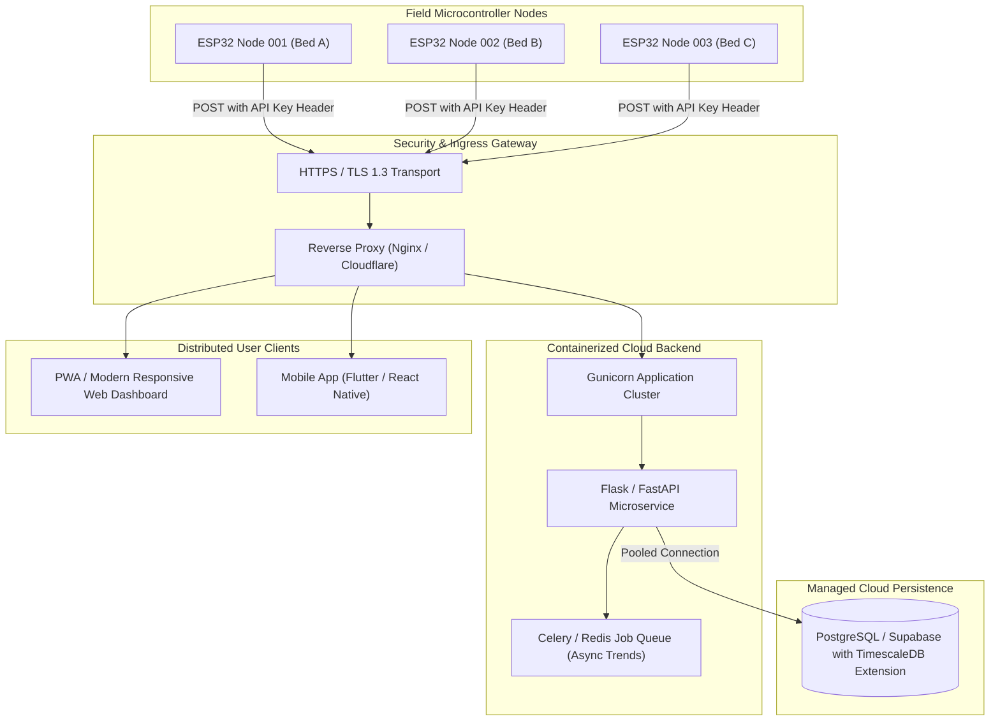

# System Architecture Specification

## 1. Architectural Overview
The system employs an Edge-to-Server IoT architecture consisting of an ESP32 edge microcontroller acquiring sensor signals, a local Flask REST API gateway processing and validating telemetry, an SQLite persistence layer, and a modern single-page dashboard for telemetry visualization and analytics.

---

## 2. Current Local Edge Architecture

```mermaid
graph TD
    subgraph Hardware_Edge ["Hardware Edge Layer (ESP32 DevKit V1)"]
        SM["Capacitive Soil Moisture Sensor (GPIO 34)"]
        TEMP["DS18B20 1-Wire Temp Sensor (GPIO 4)"]
        US["HC-SR04 Ultrasonic Sensor (Trig: 5, Echo: 18)"]
        ESP["ESP32 Firmware Engine (Device ID: ESP32_003)"]
        
        SM -->|Analog 0-3.3V| ESP
        TEMP -->|1-Wire Digital| ESP
        US -->|Pulse Timing| ESP
    end

    subgraph Network_Transport ["Local Transport Layer"]
        WIFI["Local Wi-Fi Network (802.11 b/g/n)"]
        ESP -->|HTTP POST JSON /api/sensor-data| WIFI
    end

    subgraph Backend_Gateway ["Backend Application Layer (Flask)"]
        API["Flask REST API Controller (app.py)"]
        VAL["Data Validation & Sanitization Engine"]
        CALC["Moisture RSMI Calibration Engine"]
        RISK["Temperature-Aware Drying Risk Engine"]
        HEALTH["Plant Condition Scoring Engine"]
        
        WIFI --> API
        API --> VAL
        VAL --> CALC
        CALC --> RISK
        RISK --> HEALTH
    end

    subgraph Data_Storage ["Persistence Layer"]
        DB[(SQLite Embedded DB: plant_monitor.db)]
        API -->|Insert / Query SQL| DB
    end

    subgraph Frontend_Presentation ["Presentation Layer (Web Client)"]
        UI["Modern Web Dashboard (index.html)"]
        JS["Client Application Controller (app.js)"]
        LIQ["Liquid Moisture Wave Component"]
        CHART["Chart.js Analytics Engine"]
        
        UI --> JS
        JS -->|HTTP GET /api/latest (5s)| API
        JS -->|HTTP GET /api/history (10s)| API
        JS --> LIQ
        JS --> CHART
    end
```

---

## 3. Future Cloud Architecture (Scalable Multi-Node)



---

## 4. Key Differences: Current Local vs Future Cloud

| Architectural Dimension | Current Local Edge Implementation | Future Cloud Implementation |
| :--- | :--- | :--- |
| **Network Scope** | Local Subnet (LAN) | Public Internet / Cellular IoT |
| **Ingress Protocol** | Plain HTTP over Wi-Fi | HTTPS / TLS 1.3 + MQTT over WSS |
| **Authentication** | Device ID payload string | Device API Keys (`X-API-Key`) + JWT session |
| **Database** | SQLite 3 embedded file | PostgreSQL / TimescaleDB with connection pooling |
| **Concurrency** | Single-threaded Flask dev server | Multi-worker Gunicorn + async workers |
| **Deployment Target** | Local developer PC / Raspberry Pi | Containerized Docker (Render / AWS / GCP) |
